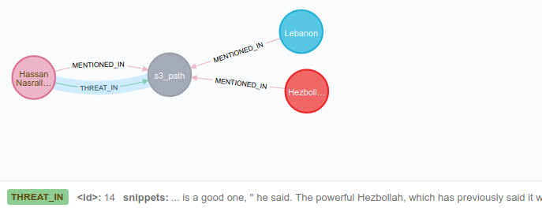

## Detect threat co-referenced with VIP

This package will search a given text file for threatening language. If threatening language is detected in the same text as a VIP, it creates a THREAT_IN relationship in the neo4j graph (output of ner_spacy). E.g.

To create this feature, we took a dataset of about ~500 violent words (`violent_words.txt`) and reduced them down to their grammatical roots (See `clean_database.py`). When we assess a new input text file, we reduce each word to its grammatical root and run a simple string search.