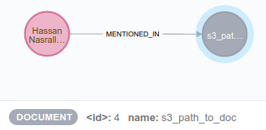

## Named Entity Recognition

This analytic takes a document, extracts entities (e.g. people, locations, companies), and adds those entities and the document to a neo4j graph as nodes, e.g:

  
  
If the document language is English and a VIP (See `vip_aliases.csv`) is in the document, it calls `detect_threat` to add information about threatening/violent language in the document to the graph.

### Environment setup

Follow the instructions in `apollo/Command/README.md` to set up your `.env` file.

```bash
# From apollo/Command
docker-compose build flask-apollo-processor named-entity-recognition
docker-compose up -d flask-apollo-processor neo4j rabbitmq named-entity-recognition 
```

### Run inference

```bash
curl localhost:8080/jobs/named_entity_recognition/ -H 'Content-Type:application/json' -X POST -d '{"path":"inputs/ner/<your file>"}'
# eg
curl localhost:8080/jobs/named_entity_recognition/ -H 'Content-Type:application/json' -X POST -d '{"path":"inputs/ner/test.txt"}'
```

### Visualize results

In your browser, navigate to `http://localhost:7474/browser/`. (Username and password defined in `Command/.env`.)
In the bar at the top, type `MATCH (n) RETURN (n);`

### Run tests

#### Unit tests

    # From ner/ner_spacy
    # Create and activate a venv for the tests using ner/ner_spacy/requirements.txt
    python -m unittest
    
    # Alternatively
    docker-compose run ner python -m unittest
    
### Change VIPs

Edit `Command/ner/ner_spacy/vip_aliases.csv`. In this csv, each row represents a person. If the person is known by multiple aliases, enter those aliases in subsequent columns.

### neo4j tips

##### To delete everything via the browser + cypher

First, delete all relationships: `MATCH ()-[r]->() DELETE r;`

Then, delete all nodes: `MATCH (n) DELETE (n);`

##### To view or delete the deployed graph

(Assuming you've configured `kubectl`)

Get the name of one of the named-entity-recognition pods by running `kubectl get pods`.

Get a shell inside the running container: 
 
 ```
 kubectl exec -it <pod name> /bin/bash
 # eg
 kubectl exec -it named-entity-recognition-release-apollo-application-78867bb7shg /bin/bash
 ```
 
 Execute neo4j util functions:
 ```
 python
 from commandutils import neo4j_utils as nu
 # View all nodes
 nu.get_all_from_graph()
 # Delete all nodes and relationships
 nu.delete_all_from_graph()
 ```