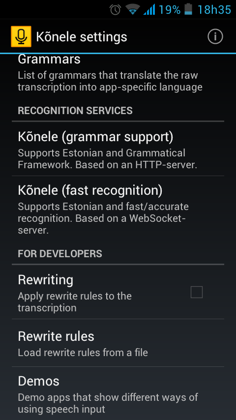
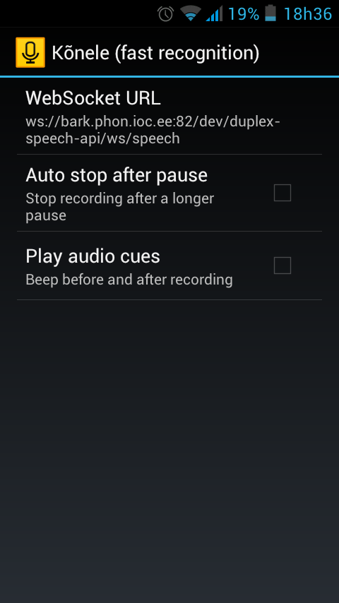
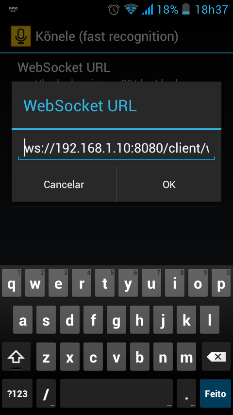
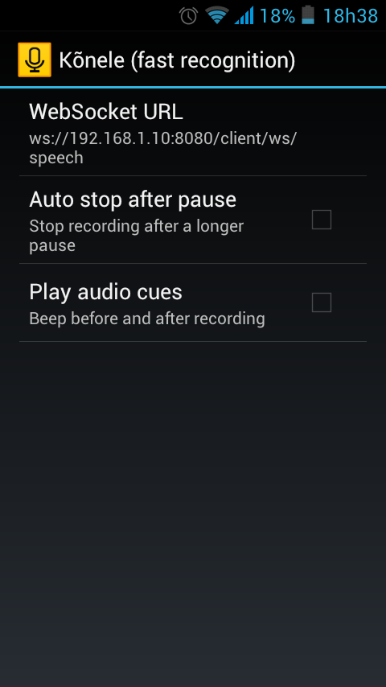
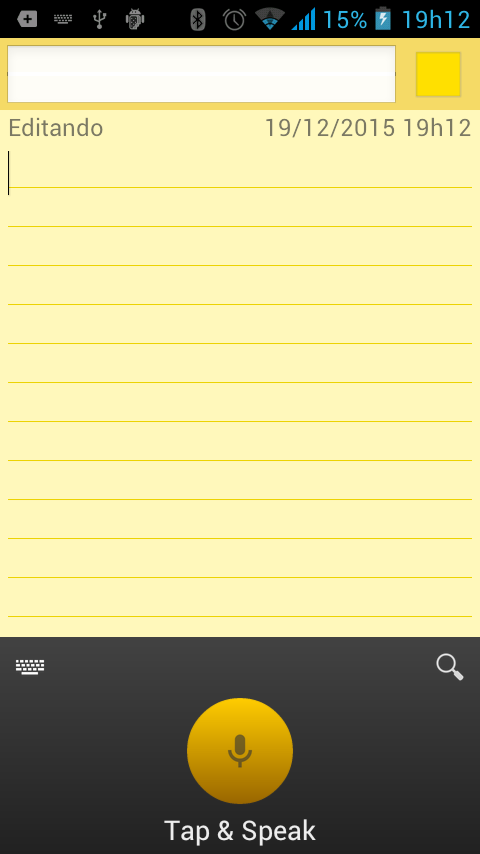
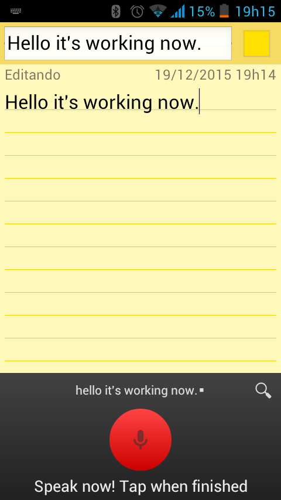

# Running Apollo Docker Image

Assuming you already built the docker image, you can test it by:

`docker run -it --rm <docker_image> ./decode_audio.bash ./bill_gates-TED.mp3`

You should get:

`
and i was a kid the disaster we worry about most was a nuclear war. that's why we had a barrel like this down our basement filled with cans of food and water when the nuclear attack came we were supposed to go downstairs hunker down and eat out of that barrel. today the greatest risk of global catastrophe doesn't look like this instead it looks like this. if anything kills over ten million people in the next few decades it's most likely to be a highly infectious virus rather than a war. not missiles that microbes now part of the reason for this is that we have invested a huge amount in nuclear deterrence we've actually invested very little in a system to stop an epidemic. we're not ready for the next epidemic.
`

*Note: This docker image can handle many audio formats including wav and mp3.*

*Note2: It should take about 20 seconds to run this example.  If it takes over a minute, we may need modify Dockerfile to make sure that we are passing the correct optimization flags to the compiler.*

# docker-kaldi-gstreamer-server
Dockerfile for [kaldi-gstreamer-server](https://github.com/alumae/kaldi-gstreamer-server).

## Synopsis

This dockerfile automatically builds master and worker servers that
are explained at [Full-duplex Speech-to-text System for
Estonian](http://ebooks.iospress.nl/volumearticle/37996) from Tanel
Alumäe and implemented by himself at
https://github.com/alumae/kaldi-gstreamer-server.

Using this project you will be able to run an automatic speech
recognition (ASR) server in a few minutes.


## Get the image 

You can either pull the docker image from Docker Hub, or build the
image from the provided Dockerfile.

### Method 1 -- Pull the image from Docker Hub (~ 900MB):

`docker pull jcsilva/docker-kaldi-gstreamer-server`

### Method 2 --  Build the image without model:

`docker build -f Dockerfile_no_model -t apollo/kaldi-gstreamer-server ./`

*NOTE: It may take a long time to build*


### Method 3 --  Build the image with model:

`docker build -t apollo/kaldi-gstreamer-server ./`

*NOTE: It may take a long time to build*


## How to use

It's possible to use the same docker in two scenarios. You may create
the master and worker on the same host machine. Or you can create just
a worker and connect it to an already existing master. These two
situations are explained below.


### Download a valid kaldi model [If needed]:
*Skip this step if you build the docker image with model already installed.*

```bash
wget https://phon.ioc.ee/~tanela/tedlium_nnet_ms_sp_online.tgz
mkdir kaldi_models
tar -C ./kaldi_models -zxvf tedlium_nnet_ms_sp_online.tgz
cp nnet2.yaml ./kaldi_models/
```

### Case 1 -- Instantiate master server and worker server on the same machine:

It's possible to use the same docker in two scenarios. You may create
the master and worker on the same host machine. Or you can create just
a worker and connect it to an already existing master. These two
situations are explained below.

```
docker run -it -p 8080:80 -v $(pwd)/kaldi_models:/opt/test/models/ jcsilva/docker-kaldi-gstreamer-server:latest /bin/bash
```

<!-- To fix an issue with websocket, we need to downgrade tornato to version 4.3 inside the container: -->

<!-- ```bash -->
<!-- apt-get update -->
<!-- apt-get -y install build-essential python-dev -->
<!-- pip install tornado==4.3 --upgrade --force-reinstall -->
<!-- ``` -->

And then, inside the container, start the service:

```
/opt/start.sh -y /opt/test/models/nnet2.yaml
```

You will see that 2 .log files (worker.log and master.log) will be
created at /opt of your containter. If everything goes ok, you will
see some lines indicating that there is a worker available. In this
case, you can go back to your host machine (`Ctrl+P and Ctrl+Q` on the
container). Your ASR service will be listening on port 8080.

The container is running in the background, to attach to the running
container, do:

```
 docker ps   ## get the container id, suppose it is ac524d3c380f
 docker attach ac524d3c380f
```

For stopping the servers, you may execute the following command inside
your container:

```
 /opt/stop.sh
```

### Case 2 -- Instantiate a worker server and connect it to a remote master:

*TODO -- 2019-11-01 (Fri) --*


## Testing

First of all, please, check if your setup is ok. It can be done using
your browser following these steps:

1. Open a websocket client in your browser (e.g:
   [Simple-WebSocket-Client](https://github.com/hakobera/Simple-WebSocket-Client)
   or http://www.websocket.org/echo.html).
 
2. Connect to your master server:
   `ws://MASTER_SERVER/client/ws/status`. If your master is on local
   host port 8080, you can try:
   `ws://localhost:8080/client/ws/status`.

3. If your setup is ok, the answer is going to be something like:
   `RESPONSE: {"num_workers_available": 1, "num_requests_processed":
   0}`.

After checking the setup, you should test your speech recognition
service. 

### Method 1: Use client.py

First, we need to install additional python library.
```bash
virtualenv venv
source venv/bin/activate
```

```bash
(venv) $: (
pip install ws4py==0.3.2
)
```

Now, we can run client.py:

```bash
(venv) $: (
python ./client.py -u ws://localhost:8080/client/ws/speech -r 32000 kaldi_test1.wav
)
```

Here 32000 means the 16-bit (16KHz?) audio.

### Method 2: Use Java Script

See subdirectory: [./dictate.js/](./dictate.js/)


### Method 3: Use Kõnele

You can use [Kõnele](http://kaljurand.github.io/K6nele/) for testing the service. It is an Android app that is freely available for downloading at Google Play. You must configure it to use your ASR service. Below you'll find some screenshots that may help you in this configuration. First, you should click on **Kõnele (fast recognition)**. Then, change the **WebSocket URL**. In my case, I connected to a master server located at ws://192.168.1.10:8080/client/ws/speech. After that, open a **notepad-like** application and change your input method to **Kõnele speech keyboard** and you'll see a **yellow button** instead of your traditional keyboard. Press this button and enjoy!



&nbsp;

&nbsp;

&nbsp;

&nbsp;

&nbsp;



Credits
--------
* [kaldi](http://www.kaldi.org)
* [gst-kaldi-nnet2-online](https://github.com/alumae/gst-kaldi-nnet2-online)
* [kaldi-gstreamer-server](https://github.com/alumae/kaldi-gstreamer-server)
* [Kõnele](http://kaljurand.github.io/K6nele/)
