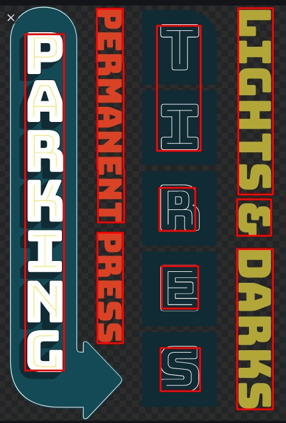

# Text localization
Predicting a bounding box around each word in an image

## Setup and inference

### Option 1: Docker

#### Setup

On the host machine, set up the following directory structure

    ├── text_loc
    │   └── test_imgs
    │       ├── 1.png
    │       └── 2.png
    
and bind mount the top level directory (e.g. text_loc) to the container, e.g. 
    
    export IMAGES=/tmp/text_loc/
    # Using CUDA-Enabled GPU
    docker run --runtime=nvidia -it -u $(id -u):$(id -g) -v $IMAGES:/container/ 604877064041.dkr.ecr.us-east-1.amazonaws.com/text_localization:0.1.0 /bin/bash
    # Without CUDA-Enabled GPU
    docker run -it -u $(id -u):$(id -g) -v $IMAGES:/container/ 604877064041.dkr.ecr.us-east-1.amazonaws.com/text_localization:0.1.0 /bin/bash
    
#### Run inference

    python test.py --test_folder=/container/test_imgs -o /container

### Option 2: Venv

#### Setup

Create and activate a Python 3 virtual environment

    python3 -m venv <path to virtual env>
    source <path to venv>/bin/activate
    
Install pytorch

    pip3 install https://download.pytorch.org/whl/cu100/torch-1.1.0-cp36-cp36m-linux_x86_64.whl
    
Install remaining dependencies

    pip3 install -r requirements.txt

#### Run inference

Put images in the ```test_imgs``` dir.

```
python test.py --test_folder=/tmp/text_loc/test_imgs/ -o /tmp/text_loc/
```
Results will be written out to a ```result``` directory inside ```text_loc```

## Model performance notes

### Ordering

As is, there's no functionality written to help maintain the order of words or letters.

### Results on vertical text



## Resources
https://github.com/clovaai/CRAFT-pytorch