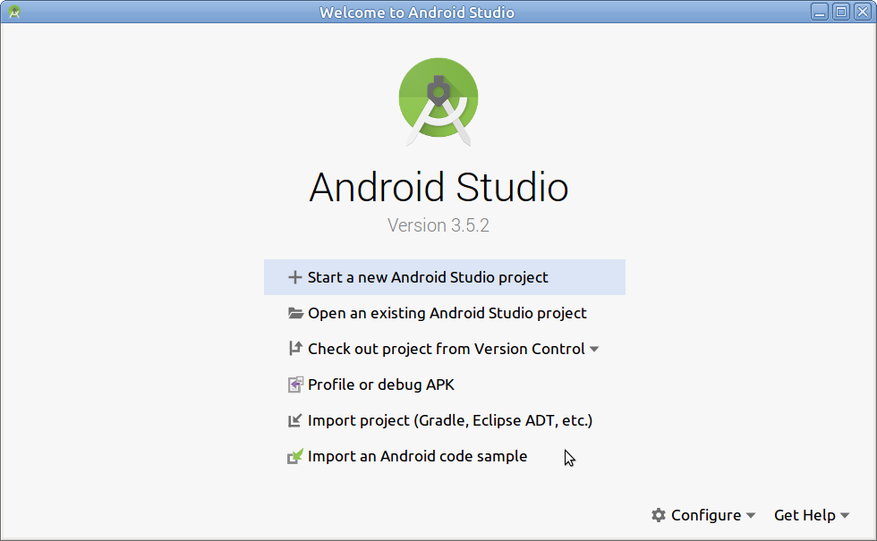
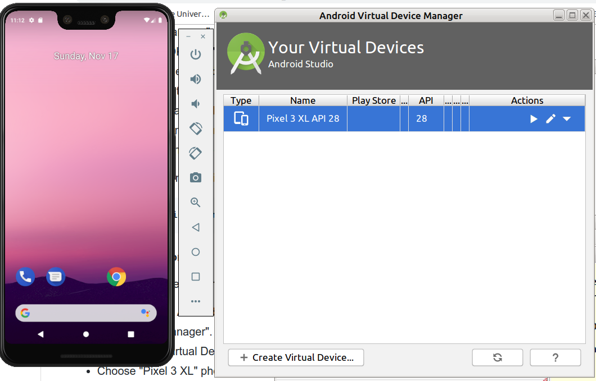
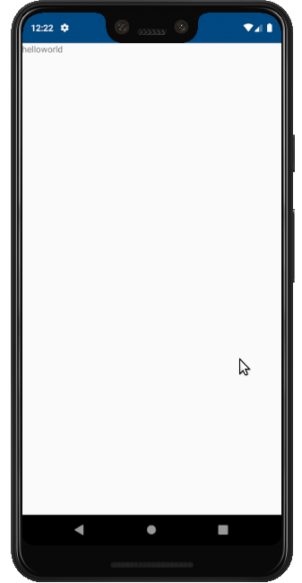
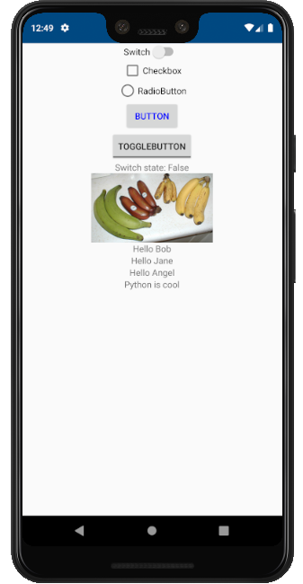
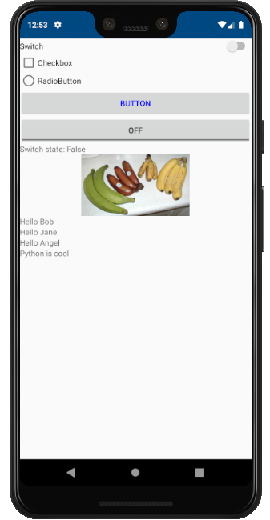
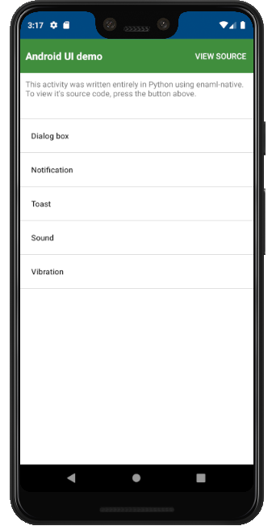
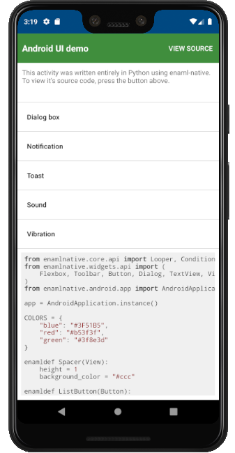
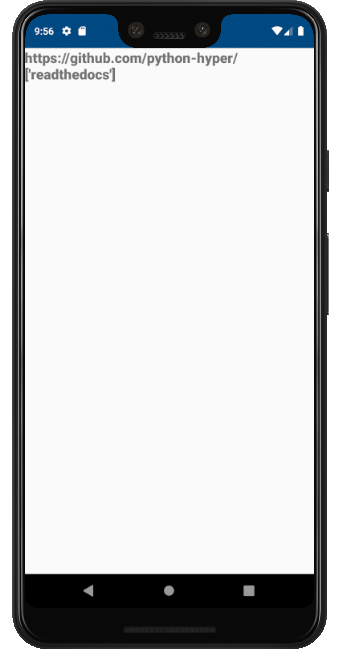
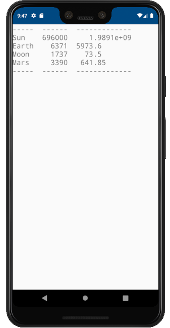
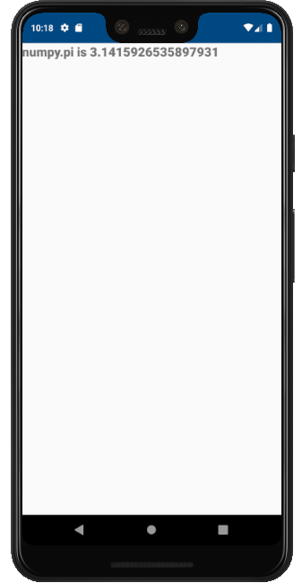

# Using Enaml-native to Create Python Android Apps

DRAFT

## Introduction

The ultimate goal is to be able to run any Python software on Android
devices.  Enaml-native is attrative because it uses native Android GUI
and can deploy and create apk files.

## Installation and Setup

<!-- The installation and setup instructions on the official project page -->
<!-- are somewhat confusing and not very well tested, especially on Linux. -->
<!-- Instead, we will follow the simplified instruction below: -->


### Step 1: Install Android Studio

Download the latest Android Studio.  As of 2019-11-16, the latest
version is 3.5.2.

```bash
$ sudo apt install -y openjdk-8-jre openjdk-8-jre-headless openjdk-8-jdk openjdk-8-jdk-headless
$ wget https://dl.google.com/dl/android/studio/ide-zips/3.5.2.0/android-studio-ide-191.5977832-linux.tar.gz
$ tar xvf android-studio-ide-191.5977832-linux.tar.gz
$ ln -s android-studio/bin/studio.sh ~/
$ rm -rf ~/.android/  ## clean up previous installation
$ rm -rf ~/AndroidStudio*
```

### Step 2: Setup Android Studio

#### Start Android Studio

```bash
$ ~/studio.sh
```

Follow the installation screen. Be sure to choose standard
configuration and use all default settings.  When finished, we will be
presented with a welcome screen.

<!-- #### Install Android SDK  -->

<!--  - On Welcome to Android Studio screen, click on "Configure" drop-down -->
<!--    menu located at the lower right corner. -->
<!--  - Select "SDK Manager" -->
<!--  - Check next to "Android 9.0 (Pie) API 28" -->
<!--  - Click "Apply" button -->
<!--  - Click "OK" and accept the license agreement. -->
<!--  - After downloading is complete, click "OK" to get back to the -->
<!--    welcome screen. -->
<!--  - close the welcome screen. -->

<!--  -->
<center></center>

#### Install NDK-Bundle

 - On the welcome screen, click the "Configure" drop-down menu
located at the lower right corner.
 - Select "SDK Manager"
 - Click the "SDK Tools" tab
 - Click "NDK (Side by Side)"
 - Click "Apply" button
 - Click "OK" and accept the license agreement
 - Wait for download to complete, then click "OK" to get back to the
   welcome screen
 - Close the welcome screen.

Now, we create a symbolic link to ndk-bundle: 
```bash
$ ln -s ~/Android/Sdk/ndk/20.1.5948944 ~/Android/Sdk/ndk-bundle
```

#### Setup SDK $PATH 

We need to be able to execute programs like "adb" from anywhere.

```bash
$ cat << "EOF" >> ~/.bashrc
export ANDROID_SDK_HOME=~/Android
export ANDROID_HOME=~/Android/Sdk
if [[ ! "$PATH" =~ $ANDROID_SDK_HOME ]]; then
    export PATH=$PATH:$ANDROID_SDK_HOME/Sdk/tools:$ANDROID_SDK_HOME/Sdk/platform-tools:$ANDROID_SDK_HOME/Sdk/tools/bin
fi
EOF
$ source ~/.bashrc
```


#### Install a Phone Emulator

If you don't have a real phone, you can use an emulator.  We will
create a virutal phone that is similar to Samsung Note8/S9.  If you
are using a real phone, make sure it's Marshmallow (Android 6.0 API
level 23) or above.  Otherwise, the app will just crash (see
[here](https://android.googlesource.com/platform/bionic/+/master/android-changes-for-ndk-developers.md#gnu-hashes-availible-in-api-level-23)
for the explanation).

 - On the welcome screen, click the "Configure" drop-down
menu located at the lower right corner
 - Select "AVD Manager"
 - Click "Create Virtual Device"
 - Select "Pixel 3 XL" phone device
 - Click "Pie Download" to download API 28 and accept license agreements
 - After download, select "Pie" and click "Next" button
 - Click "Finish"
 - Double click the blue highlighted line to start the emulator
 - We should now see a virtual phone displayed on the screen
 - Click the power icon to turn on the virutal phone

<!--  -->
<center></center>


### Step 3: Install and Setup Miniconda3

```bash
## Get that latest miniconda3, as of 2019-11-17, the latest is version 4.7.12
$ wget https://repo.anaconda.com/miniconda/Miniconda3-4.7.12.1-Linux-x86_64.sh

## Below, follow the prompt until you get to the question: 
## "Do you wish the installer to initialize Miniconda3 by 
## running conda init? [yes|no]", enter "yes"
$ bash ./Miniconda3-4.7.12.1-Linux-x86_64.sh

## We don't want conda env to activate automatically
$ ~/miniconda3/bin/conda config --set auto_activate_base false
$ source ~/.bashrc

## Install conda-build and create a python 3.7 conda env 
$ conda install -y conda-build
$ conda create -n enaml-env python=3.7

## Add colelv channel
$ conda config --add channels codelv

## Enter the python 3.7 conda env 
$ conda activate enaml-env
$ conda env list
```

### Step 4: Install Enaml-Native-Cli

``` bash
## enter conda env
$ conda activate enaml-env   

## install enaml-native-cli, latest version is 2.3.1 as of 2019-11-17
(enaml-env)$ pip install enaml-native-cli 
```

As of 2019-11-16, we need to fix and work around three bugs.
  1. wrong version of pip-ply
  2. app_name can not contain spaces
  3. android/gradlew not executable

```bash
(enaml-env)$ (
## Fix wrong pip-ply version
sed -i.bak '/- enaml-native$/i\  - pip-ply=3.11=h204e2d7_0' \
  ~/miniconda3/envs/enaml-env/lib/python3.7/site-packages/enamlnativecli/templates/app/{{cookiecutter.project_name}}/environment.yml
)
```

```bash
(enaml-env)$ (
## Fix spaces in app_name
sed -i.bak 's/Hello World/helloworld/' \
  ~/miniconda3/envs/enaml-env/lib/python3.7/site-packages/enamlnativecli/templates/app/cookiecutter.json
)
```

## Examples

Now let's create some examples.

### 1. Hello World

We will create a simple "hello world" Androd App.

First, we activate the enaml-native conda environment (actually, it
can be any Python3 environment with enaml-native-cli installed):

```bash
$ conda activate enaml-env
```

Then, we create a project skeleton by executing the command below and
using default settings.  This will create a `helloworld` directory.

```bash
(enaml-env)$ enaml-native create app
```

Now, we need to active the helloworld project conda environment:

```bash
(enaml-env)$ conda activate helloworld
```

If we just want to compile and create apk file:

```bash
(helloworld)$ (
cd helloworld
chmod a+x android/gradlew
enaml-native build-android
)
```

If an emulator or phone is attached, we can compile and run the app in one step:

```bash
(helloworld)$ (
cd helloworld
chmod a+x android/gradlew
enaml-native run-android
)
```

Alternatively, we can use "adb" to install and run the app:
```bash
## upload/install apk (x86 or x86_64) to the virtual phone
$ adb install android/app/build/outputs/apk/debug/app-x86-debug.apk

## OR,if attached to a real phone upload armeabi-v7a or arm64 apk
$ adb install android/app/build/outputs/apk/debug/app-armeabi-v7a-debug.apk

## start the app
$ adb shell am start -n com.example.helloworld/.MainActivity
```

<center></center>


### 2. Some Basic GUI Widgets

Modify `helloworld/src/view.enaml` as listed below (code snippets taken
from [here](https://www.codelv.com/projects/enaml-native/docs/introduction)).

```python
from enamlnative.android.app import AndroidApplication
from enaml.application import Application
from enamlnative.widgets.api import *

enamldef Greeting(TextView):
    attr myname = ""
    text << "Hello {}".format(myname)

enamldef Blink(TextView):
    #: Visible by default
    visible = True

    #: Called when component is activated
    activated :: blink()

    #: Blink and then schedule it to blink again
    func blink():
        # Toggle the visibility
        self.visible = not self.visible

        # Schedule blink again 1 second later
        app = Application.instance()
        app.timed_call(1000, blink)
        
enamldef ContentView(Flexbox):
    flex_direction = "column"
#    align_items = "center"
    
    Switch: sw:
       text = "Switch"
    CheckBox: cb:
        text = "Checkbox"
        #: Two way binding
        checked := sw.checked
    RadioButton:
        text = "RadioButton"
        checked := cb.checked
    Button:
        text = "Button"
        text_color = "#0000FF"
        flat = False
        clicked :: AndroidApplication.instance().show_toast(
            "You tapped the button!")

    ToggleButton:
        text = "ToggleButton"
        checked := sw.checked
        # toggled :: print('I was toggled')
    TextView:
        text << "Switch state: {}".format(sw.checked)
    ImageView:
        src = ("https://upload.wikimedia.org/wikipedia/" +
               "commons/d/de/Bananavarieties.jpg")
        width = 193
        height = 110

    Greeting:
        myname = "Bob"
    Greeting:
        myname = "Jane"    
    Greeting:
        myname = "Angel"
    Blink:
        text = "Python is cool"
```

Re-compile and run. We should see a more fancier screen shown below.

```bash
(helloworld)$ enaml-native run-android
```

<center>
</center>

  - Code explanation can be found [here](https://www.codelv.com/projects/enaml-native/docs/introduction).  Note, some info are outdated.

  - See [more examples](https://github.com/codelv/enaml-native/tree/master/examples).


  - [Enaml Syntax and short video tutorials](https://www.youtube.com/watch?v=nZdPm0NB8lY&list=PLXUaMWWFaOjT2WdIrJdTYjEMJmrjuvVz0)
  - [Enaml API Documentation](https://enaml.readthedocs.io/en/latest/)
  - [Enaml-Native API Documentation](https://enaml-native.readthedocs.io/en/latest/)


### 3. Chaquopy Example

Replace `helloworld/src/view.enaml` with [chaquopy.enaml](https://github.com/codelv/enaml-native/blob/master/examples/chaquopy.enaml).  This example was used in a blog [comparing enaml-native and chaquopy](http://blog.codelv.com/2018/02/a-look-at-chaquopy-python-sdk-for.html).

```bash
(helloworld)$ enaml-native run-android
```

<center>
</center>

  
<!-- ### 3. Some Basic Model-View-Controller Framework -->
  
<!-- Let's modify `helloworld/src/view.enaml` again and also add a model -->
<!-- module `helloworld/src/models.py`. -->


<!-- ### 4. A Simple File Checker -->


### 3. Using Pre-packaged, Pure-python Libraries

There are many Python libraries already packaged for enaml-native.
These packages can be installed from the `codelv` repository
(https://github.com/codelv/conda-mobile and
https://anaconda.org/codelv/repo).

If a Python library is pure (meaning no part is written in C or other
languages), then the enaml-native package name has prefix "pip-".

As an example, suppose we want to use `hyperlink` library.  The
 package is called `pip-hyperlink` in the `codelv` repository.
 To install it into our helloworld project, do:

```bash
(helloworld)$ (
cd helloworld
enaml-native install pip-hyperlink
)
```

To use the library, we can modify `src/view.enaml` as listed below.

```python
from enamlnative.core.api import *
from enamlnative.widgets.api import *
from hyperlink import URL  # testing...

url = URL.from_text(u'http://github.com/python-hyper/hyperlink?utm_source=readthedocs')
better_url = url.replace(scheme=u'https', port=443)
org_url = better_url.click(u'.')

enamldef ContentView(Flexbox):
    flex_direction = "column"
    TextView:
        text = org_url.to_text() + "\n" + str (better_url.get(u'utm_source'))
        text_size = 20
        font_family= "sans-serif-black"
```

```bash
(helloworld)$ enaml-native run-android
```

<center></center>


### 4. Using any Pure-python Library

If a pure python library is not available in the `codelv`
repository, we can use `pip` to install the library to specific
locations.  In this example, we will install `tabulate` (from the
`PyPI` repository).

```bash
(helloworld)$ (
cd helloworld
pip install tabulate --target=venv/android/{arm,arm64,x86,x86_64}/python/site-packages
)
```

To use the library, we can modify `src/view.enaml` as listed below.


```python
from enamlnative.core.api import *
from enamlnative.widgets.api import *
from tabulate import tabulate  # testing...

table = [["Sun",696000,1989100000],["Earth",6371,5973.6],
         ["Moon",1737,73.5],["Mars",3390,641.85]]

enamldef ContentView(Flexbox):
    flex_direction = "column"
    TextView:
        font_family = "monospace"
        text_size = 20
        text = tabulate(table)
```

```bash
(helloworld)$ enaml-native run-android
```

<center></center>


### 5. Using Pre-packaged, Pre-compiled Python Libraries

If a Python library is not pure (meaning some parts are written in C
or other languages), then the enaml-native package name has "android-"
prefix.

As an example, suppose we want to use `numpy`.  We first check to see
if it is in the `codelv` repository already (look for `android-numpy` in https://anaconda.org/codelv/repo).
To install it into the helloworld project, do:

```bash
(helloworld)$ (
cd helloworld
enaml-native install android-numpy
)
```

To use the library, we can modify `src/view.enaml` as listed below.

```python
from enamlnative.core.api import *
from enamlnative.widgets.api import *
import numpy  # testing...

enamldef ContentView(Flexbox):
    flex_direction = "column"
    TextView:
        text = "numpy.pi is " + str (numpy.pi)
        text_size = 20
        font_family= "sans-serif-black"
```

```bash
(helloworld)$ enaml-native run-android
```

<center></center>


### 6. Using any Non-Pure Python Library

If a non-pure python library is not already available in the `codelv`
repository, we can try to find it in other android repositories (e.g.,
kivy repository may have it already).  Or, we can build and package
the library ourselves.

TODO -- Need to understand the instruction given below:
  - https://github.com/codelv/conda-mobile
  - https://www.codelv.com/projects/enaml-native/docs/project-and-building
  - https://docs.conda.io/projects/conda/en/latest/user-guide/concepts/packages.html#mutex-metapackages
  - https://github.com/kivy/python-for-android


